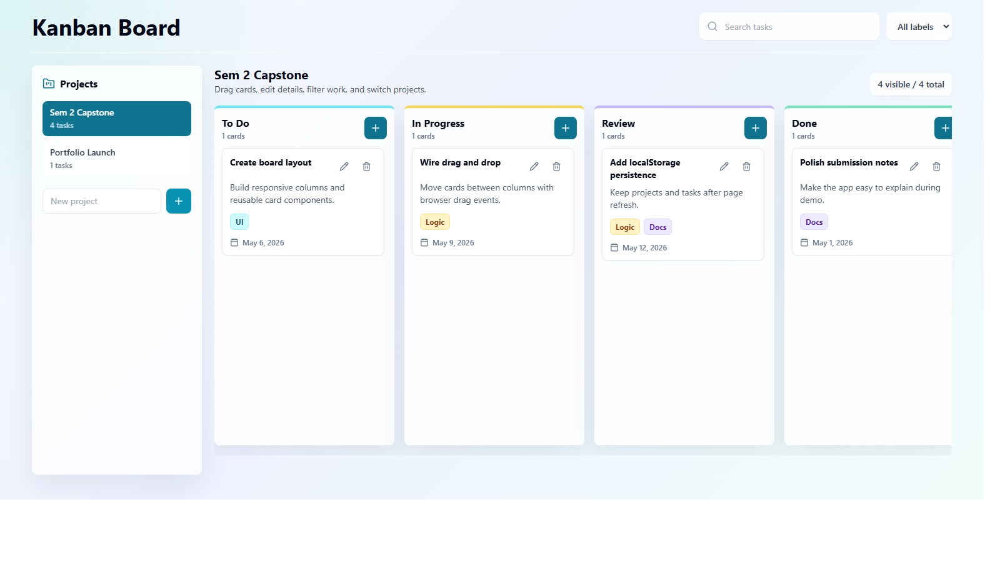

# Capstone Kanban Board

Front-end only Kanban board built with React, JavaScript, Tailwind CSS, and localStorage.



## Features

- Multiple projects
- Drag and drop task movement
- Task editing
- Labels, due dates, and search filters
- localStorage persistence

## Run

```bash
npm install
npm run dev
```
# 📋 Capstone Kanban Board


> A dynamic, interactive Kanban Board application built for efficient task and project management — deployed live on Vercel.

🔗 **Live Demo:** [https://kanban-board-puce-ten.vercel.app/](https://kanban-board-puce-ten.vercel.app/)

---

## 📖 Table of Contents

- [About the Project](#about-the-project)
- [Features](#features)
- [Tech Stack](#tech-stack)
- [Getting Started](#getting-started)
- [Installation](#installation)
- [Usage](#usage)
- [Project Structure](#project-structure)
- [Deployment](#deployment)
- [Project Report](#project-report)
- [Contributing](#contributing)


---

##  About the Project

The **Capstone Kanban Board** is a full-featured task management tool inspired by the Kanban methodology — a visual workflow system that helps teams and individuals manage work by depicting tasks on a board with columns representing different stages of progress.

This project was built as a capstone project to demonstrate proficiency in building a real-world, interactive web application with modern frontend technologies.

---

##  Features

-  **Create, Edit & Delete Tasks** — Full CRUD functionality for task cards
-  **Multiple Columns** — Organize tasks across stages (e.g., To Do, In Progress, Done)
-  **Drag & Drop** — Intuitively move cards between columns
-  **Task Labels & Priorities** — Categorize tasks with color-coded labels
-  **Persistent State** — Tasks saved across sessions (localStorage / backend)
-  **Responsive Design** — Works seamlessly on desktop, tablet, and mobile
-  **Fast & Lightweight** — Optimized for performance with minimal load times
-  **Live Deployment** — Hosted on Vercel with continuous deployment

---

## 🛠️ Tech Stack

| Layer        | Technology                         |
|--------------|------------------------------------|
| Frontend     | React.js / HTML5 / CSS3            |
| Styling      | Tailwind CSS / CSS Modules         |
| State Mgmt   | React Hooks / Context API          |
| Drag & Drop  | react-beautiful-dnd / HTML5 DnD    |
| Build Tool   | Vite / Create React App            |
| Deployment   | Vercel                             |
| Version Ctrl | Git & GitHub                       |

> *Adjust the tech stack entries above to match your actual implementation.*

---

## 🚀 Getting Started

### Prerequisites

Make sure you have the following installed:

- [Node.js](https://nodejs.org/) (v16 or higher)
- [npm](https://www.npmjs.com/) or [yarn](https://yarnpkg.com/)
- [Git](https://git-scm.com/)

---

## 📦 Installation

1. **Clone the repository**

```bash
git clone https://github.com/your-username/kanban-board.git
cd kanban-board
```

2. **Install dependencies**

```bash
npm install
# or
yarn install
```

3. **Start the development server**

```bash
npm run dev
# or
yarn dev
```

4. **Open in your browser**

```
http://localhost:3000
```

---

## 🧭 Usage

1. **Add a new task** by clicking the `+ Add Task` button in any column.
2. **Edit a task** by clicking on the task card to open the edit modal.
3. **Move tasks** by dragging and dropping cards between columns.
4. **Delete a task** using the delete icon on any card.
5. **Add new columns** to customize your workflow stages.

---

## 🗂️ Project Structure

```
kanban-board/
├── public/
│   └── index.html
├── src/
│   ├── components/
│   │   ├── Board/
│   │   ├── Column/
│   │   ├── Card/
│   │   └── Modal/
│   ├── context/
│   │   └── KanbanContext.js
│   ├── hooks/
│   │   └── useDragDrop.js
│   ├── utils/
│   │   └── helpers.js
│   ├── App.jsx
│   └── main.jsx
├── .gitignore
├── package.json
├── README.md
└── vite.config.js
```

---

## ☁️ Deployment

This project is deployed on **Vercel** with automatic deployments on every push to the `main` branch.

To deploy your own version:

1. Fork this repository
2. Create a free account on [Vercel](https://vercel.com/)
3. Import the repository from GitHub
4. Click **Deploy** — Vercel handles the rest automatically

---

## 📊 Project Report

### 1. Introduction

The Capstone Kanban Board project was developed to deliver a practical, real-world task management solution using modern web development practices. The Kanban methodology originates from Toyota's lean manufacturing process and has been widely adopted in software development through frameworks like Agile and Scrum.

This project translates the physical Kanban board into an interactive digital application accessible from any browser, demonstrating both frontend engineering skills and UI/UX design sensibility.

---

### 2. Objectives

- Build a fully functional Kanban Board with CRUD operations for tasks and columns
- Implement drag-and-drop functionality for seamless task movement
- Design a clean, responsive, and intuitive user interface
- Deploy the application to a live production environment
- Apply best practices in component architecture, state management, and code organization

---

### 3. Methodology

**Development Approach:** Agile (iterative sprints)

| Phase       | Description                                              | Duration     |
|-------------|----------------------------------------------------------|--------------|
| Planning    | Requirements gathering, wireframing, tech stack selection | Week 1       |
| Design      | UI/UX mockups, color scheme, component hierarchy         | Week 1–2     |
| Development | Core feature implementation (columns, cards, drag & drop)| Week 2–4     |
| Testing     | Unit testing, responsive testing, bug fixes              | Week 4–5     |
| Deployment  | Vercel deployment, CI/CD pipeline setup                  | Week 5       |
| Review      | Final review, documentation, polish                      | Week 5–6     |

---

### 4. Features Implemented

| Feature                        | Status       |
|-------------------------------|--------------|
| Task creation / editing        |  Completed |
| Task deletion                  |  Completed |
| Drag and drop between columns  |  Completed |
| Multiple workflow columns      |  Completed |
| Responsive mobile layout       |  Completed |
| Persistent data (localStorage) |  Completed |
| Live deployment on Vercel      |  Completed |

---

### 5. Challenges Faced

| Challenge                              | Solution Applied                                          |
|----------------------------------------|-----------------------------------------------------------|
| Implementing smooth drag-and-drop      | Used `react-beautiful-dnd` library for reliable DnD UX   |
| Managing complex state across columns  | Centralized state with React Context API                  |
| Responsive layout for small screens   | Flexbox + CSS media queries for adaptive layouts          |
| Preventing data loss on page refresh   | Persisted board state in `localStorage`                   |

---

### 6. Learnings & Outcomes

Through this project, the following technical and conceptual skills were strengthened:

- **Component-Based Architecture**: Breaking down the UI into reusable, composable React components
- **State Management**: Managing complex shared state without external libraries using Context + Hooks
- **UX Design**: Designing intuitive drag-and-drop workflows with clear visual feedback
- **Deployment Pipeline**: Setting up CI/CD via GitHub + Vercel for seamless production releases
- **Code Organization**: Structuring a scalable codebase with clear separation of concerns

---

### 7. Future Enhancements

- 🔐 **User Authentication** — Login/signup to save personal boards
- 🗃️ **Backend Integration** — Persist data to a database (Firebase / Supabase / MongoDB)
- 👥 **Team Collaboration** — Real-time multi-user boards using WebSockets
- 📅 **Due Dates & Reminders** — Calendar integration for task deadlines
- 📊 **Analytics Dashboard** — Visual insights into task completion rates
- 🌙 **Dark Mode** — Toggle between light and dark themes

---

### 8. Conclusion

The Capstone Kanban Board successfully demonstrates a production grade web application that is functional, visually polished, and deployed live. The project reinforces core frontend development principles while delivering genuine utility for anyone looking to manage tasks visually. It serves as a strong capstone demonstration of skills in React, UI design, state management, and cloud deployment.

---

## 🤝 Contributing

Contributions are welcome! If you'd like to improve this project:

1. Fork the repository
2. Create a new branch: `git checkout -b feature/your-feature-name`
3. Commit your changes: `git commit -m 'Add some feature'`
4. Push to the branch: `git push origin feature/your-feature-name`
5. Open a Pull Request

---


---

<div align="center">

Made by Paras Jain and deployed on [Vercel](https://vercel.com/)

⭐ If you found this useful, consider giving it a star!

</div>
